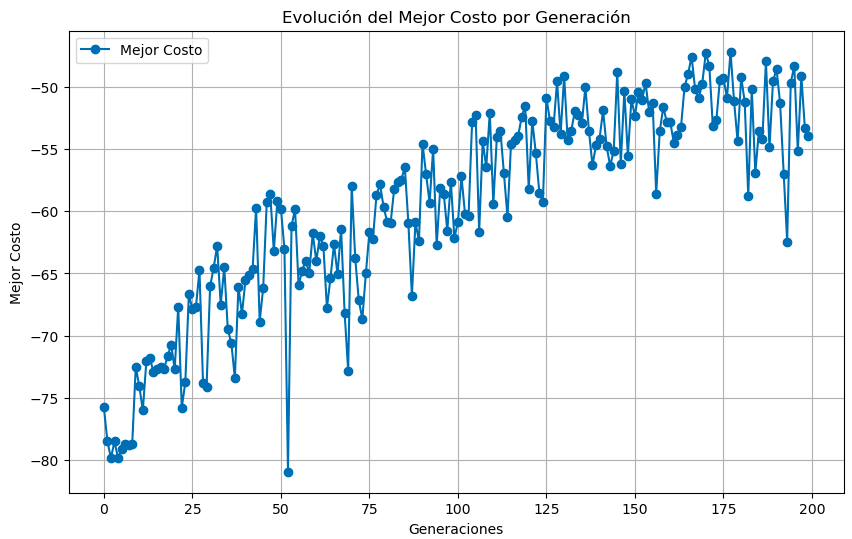

# Genetic Algorithm for Logistic Route Optimization

This project implements a genetic algorithm to solve complex logistical problems, such as optimizing routes for vehicles transporting customer orders, minimizing costs, and ensuring solution feasibility.


## General Description

The goal of the algorithm is to find the optimal configuration for assigning orders to vehicles and generating efficient routes. The model takes into account:

- **Vehicles**: Defined by their capacity, cost per kilometer, and autonomy.
- **Customers**: Each with specific transport demands.
- **Distances**: A distance matrix between locations.

The genetic algorithm employs classic techniques such as selection, crossover, and mutation to iteratively improve the solutions.

## Key Features

A genetic algorithm works as follows:

1. **Initial Population**: Randomly generates potential solutions. Each solution represents a set of routes.

2. **Evaluation (Fitness)**: Each solution is evaluated using a fitness function that considers factors such as total cost and route feasibility.

3. **Parent Selection**: The best solutions ("parents") are chosen using methods such as tournaments or roulette to contribute to the next generation.

4. **Crossover**: Selected parents are combined to create new solutions ("offspring"), mixing characteristics of both.

5. **Mutation**: Small random alterations are introduced into the solutions, such as changing the order of customers in a route, to explore new possibilities and avoid stagnation.

6. **New Generation**: The offspring replace the previous population, and the process repeats until a stopping criterion is met, such as reaching a maximum number of generations or achieving stable results.

The central idea is inspired by Darwin's theory of evolution: the fittest solutions survive and evolve, while the less fit are discarded.

## Project Structure

- **data/**: Contains input data such as the distance matrix (`df_distance_km.xlsx`), historical demands (`df_historic_order_demand.xlsx`) and vehicle data (`df_vehicle.xlsx`).
- **main.ipynb**: Main notebook implementing the algorithm.

## Requirements

- Python 3.8+
- Required libraries:
  - `numpy`
  - `pandas`
  - `random`

## Usage

1. Clone this repository:
   ```bash
   git clone https://github.com/your-username/genetic-algorithm-logistics.git
